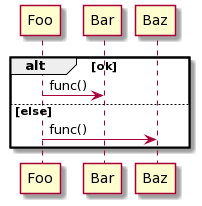

# Basic Examples
Following examples are auto-generated by
[demo/demo_examples.py](demo/demo_examples.py)

## Objects and calls

```python
@napkin.seq_diagram('Objects and calls')
def ex_calls(c):
    # All objects to be used should be defined first
    foo = c.object('Foo')
    bar = c.object('Bar')

    # Top level 'with' specifies the caller.
    with foo:
        # <object>.<func name>() means <func name> call to the object
        bar.funcName()
        # <object> can be the caller, which means call to self
        foo.otherFuncName()

    # Now switches the caller to other object
    with bar:
        # Functions with parameters
        foo.doSomething("paramFoo", paramBar="value", paramBaz=4)

```
## Nested calls

```python
@napkin.seq_diagram('Nested calls')
def ex_nc(c):
    foo = c.object('Foo')
    bar = c.object('Bar')
    baz = c.object('Baz')

    with foo:
        with bar.func():
            baz.func2()

```
## Calls with return value

```python
@napkin.seq_diagram('Calls with return value')
def ex_cwr(c):
    foo = c.object('Foo')
    bar = c.object('Bar')

    with foo:
        # Simple call/return
        bar.func().ret('v1')

        with bar.func():
            bar.other_func()
            c.ret('v2')

```
## Pass other object to call

```python
@napkin.seq_diagram('Pass other object to call')
def ex_poc(c):
    foo = c.object('Foo')
    bar = c.object('Bar')
    baz = c.object('Baz')

    with foo:
        bar.DoSomething(baz, "other value")

```
## Specify class, object and stereotype

```python
@napkin.seq_diagram('Specify class, object and stereotype')
def ex_scos(c):
    foo = c.object('firstInstance', cls='Foo')
    bar = c.object('Bar', stereotype='active')
    baz = c.object('other', stereotype='external', cls='Baz')

    with foo:
        bar.doA()
        baz.doB()

```
## Loop

```python
@napkin.seq_diagram('Loop')
def ex_loop(c):
    foo = c.object('Foo')
    bar = c.object('Bar')

    with c.loop():
        with foo:
            bar.func()
            with c.loop('until done'):
                foo.func_other()

```
## Alt

```python
@napkin.seq_diagram('Alt')
def ex_alt(c):
    foo = c.object('Foo')
    bar = c.object('Bar')
    baz = c.object('Baz')

    with c.alt():
        with c.choice('ok'):
            with foo:
                bar.func()
        with c.choice('else'):
            with foo:
                baz.func()

```
## Create and destroy object

```python
@napkin.seq_diagram('Create and destroy object')
def ex_cd(c):
    foo = c.object('Foo')
    bar = c.object('Bar')
    with foo:
        c.create(bar)
        bar.func()
        c.destroy(bar)

```
