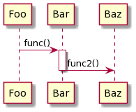
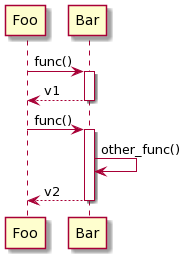
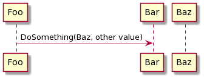

# Examples

Following examples are auto-generated by
[demo/readme_examples.py](./demo/readme_examples.py)
    
## Nested calls

```python
@napkin.seq_diagram('Nested calls')
def ex_nc(c):
    foo = c.object('foo')
    bar = c.object('bar')
    baz = c.object('baz')

    with foo:
        with bar.func():
            baz.func2()

```

## Calls with return value

```python
@napkin.seq_diagram('Calls with return value')
def ex_cwr(c):
    foo = c.object('foo')
    bar = c.object('bar')

    with foo:
        # Simple call/return
        bar.func().ret('v1')

        with bar.func():
            bar.other_func()
            c.ret('v2')

```

## Pass other object to call

```python
@napkin.seq_diagram('Pass other object to call')
def ex_poc(c):
    foo = c.object('foo')
    bar = c.object('bar')
    baz = c.object('baz')

    with foo:
        bar.DoSomething(baz, "other value")

```

## Loop

```python
@napkin.seq_diagram('Loop')
def ex_loop(c):
    foo = c.object('foo')
    bar = c.object('bar')

    with c.loop():
        with foo:
            bar.func()
            with c.loop('until done'):
                foo.func_other()

```

## Alt

```python
@napkin.seq_diagram('Alt')
def ex_alt(c):
    foo = c.object('foo')
    bar = c.object('bar')
    baz = c.object('baz')

    with c.alt():
        with c.choice('ok'):
            with foo:
                bar.func()
        with c.choice('else'):
            with foo:
                baz.func()

```

## Create and destroy object

```python
@napkin.seq_diagram('Create and destroy object')
def ex_cd(c):
    foo = c.object('foo')
    bar = c.object('bar')
    with foo:
        c.create(bar)
        bar.func()
        c.destroy(bar)

```
