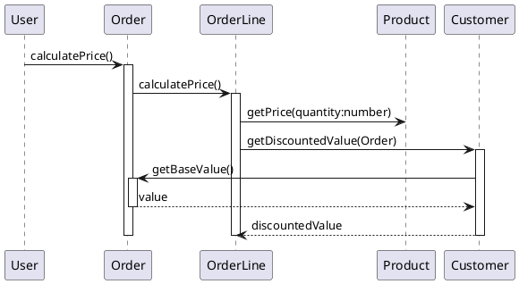

[](https://travis-ci.org/pinetr2e/napkin)
# Napkin 

Napkin is a tool to "write" sequence diagrams effectively as Python code.


## Motivation
The sequence diagrams are useful tool to capture the behavioural aspect of the
design. [PlantUML](http://plantuml.com) is a great tool to draw nice sequence
diagrams with simple human readable plain text.

However, the syntax of PlantUML is hard to use when there are nested calls,
where lifeline with multiple activation/deactivations are involved.
Unfortunately, this situation is quite common in sequence diagram for S/W.

For example, consider the following common sequence diagram,
which is from [Figure 4.2, UML Distilled 3E](https://my.safaribooksonline.com/book/software-engineering-and-development/uml/0321193687/sequence-diagrams/ch04):


The PlainUML script for the diagram will be as follows:

It is quite hard to follow especially as there are multiple level of nested actviation/deactivation.

What if we express the same thing as the following Python code ?
```python

@napkin.seq_diagram()
def distributed_control(c):
    user = c.object('User')
    order = c.object('Order')
    orderLine = c.object('OrderLine')
    product = c.object('Product')
    customer = c.object('Customer')

    with user:
        with order.calculatePrice():
            with orderLine.calculatePrice():
                product.getPrice('quantity:number')
                with customer.getDiscountedValue(order):
                    order.getBaseValue().ret('value')
                    c.ret('discountedValue')
```
`distributed_control` is normal function accepting a context object, `c` to access APIs.
The function defines objects and the control starts with `user` object, which then calls `orderLine.calculatePrice()`.
Basically, the sequence diagram is expressed as "almost" normal python code.

There are several advantages in using Python instead of using other special
syntax language:
* Easy to write/maintain scripts for the correct diagrams
* Many common mistakes are detected as normal Python error. For example, method
  call to an undefined object will be just normal Python error.(This can be even
  checked by IDE without running scripts).
* Any Python editor can become sequence diagram editor
* There can be many interesting usages by taking advantage of Python as general
  language. For example, we can build a library for patterns.


## Installation

Install and update using `pip`
```
pip install -U napkin
```

## Hello world

Write a simple script called `hello.py` as follows:

```python
import napkin

@napkin.seq_diagram()
def hello_world(c):
    user = c.object('user')
    world = c.object('world')
    with user:
        world.hello()
```
Then, the following command will generate `hello_world.uml`:
```
$ napkin hello.py
```

## More examples
[See more examples](./EXAMPLES.md)
