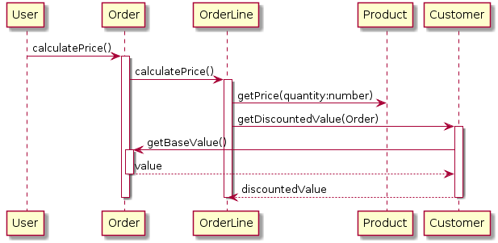
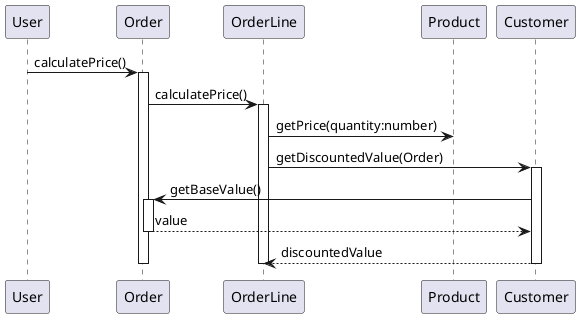

[](https://travis-ci.org/pinetr2e/napkin)
[](https://badge.fury.io/py/napkin)
# Napkin

Napkin is a tool to "write" sequence diagrams effectively as Python code.


## Motivation
The sequence diagrams are useful tool to capture the behavioural aspect of the
design. [PlantUML](http://plantuml.com) is a great tool to draw nice sequence
diagrams with simple human readable plain text.

However, the syntax of PlantUML is hard to use when there are nested calls,
where lifeline with multiple activation/deactivation are involved.
Unfortunately, this situation is quite common in sequence diagram for S/W.

For example, consider the following common sequence diagram,
which is from [Figure 4.2, UML Distilled 3E](https://my.safaribooksonline.com/book/software-engineering-and-development/uml/0321193687/sequence-diagrams/ch04):


The PlainUML script for the diagram will be as follows:

It is quite hard to follow especially as there are multiple level of nested activation/deactivation.

What if we express the same thing as the following Python code ?
```python

@napkin.seq_diagram()
def distributed_control(c):
    user = c.object('User')
    order = c.object('Order')
    orderLine = c.object('OrderLine')
    product = c.object('Product')
    customer = c.object('Customer')

    with user:
        with order.calculatePrice():
            with orderLine.calculatePrice():
                product.getPrice('quantity:number')
                with customer.getDiscountedValue(order):
                    order.getBaseValue().ret('value')
                    c.ret('discountedValue')
```
`distributed_control` is normal function accepting a context object, `c` to access APIs.
The function defines objects and the control starts with `user` object, which then calls `orderLine.calculatePrice()`.
Basically, the sequence diagram is expressed as "almost" normal python code.

There are several advantages in using Python instead of using other special
syntax language:
* Easy to write/maintain scripts for the correct diagrams
* Many common mistakes are detected as normal Python error. For example, method
  call to an undefined object will be just normal Python error.(This can be even
  checked by IDE without running scripts).
* Any Python editor can become sequence diagram editor
* There can be many interesting usages by taking advantage of Python as general
  language. For example, we can build a library for patterns.


## Installation

Install and update using `pip`
```shell
$ pip install napkin
```

## Hello world

Write a simple script called `hello.py` as follows:

```python
import napkin

@napkin.seq_diagram()
def hello_world(c):
    user = c.object('user')
    world = c.object('world')
    with user:
        world.hello()
```
Then, the following command will generate `hello_world.puml`:
```shell
$ napkin hello.py
```

## Usages

### Command line
```
usage: napkin [-h] [--output-format {plantuml,plantuml_png,plantuml_svg,plantuml_txt}] [--output-dir OUTPUT_DIR] [--version] [--server-url SERVER_URL]
              srcs [srcs ...]

Generate UML sequence diagram from Python code

positional arguments:
  srcs                  Python file or directory containing diagram functions

optional arguments:
  -h, --help            show this help message and exit
  --output-format {plantuml,plantuml_png,plantuml_svg,plantuml_txt}, -f {plantuml,plantuml_png,plantuml_svg,plantuml_txt}
  --output-dir OUTPUT_DIR, -o OUTPUT_DIR
  --version             show program's version number and exit
  --server-url SERVER_URL
                        (only for plantuml_png/svg format) Default is the public server

Supported output formats:
  plantuml         : PlantUML script (default)
  plantuml_png     : PlantUML script and PNG image
  plantuml_svg     : PlantUML script and SVG image
  plantuml_txt     : PlantUML script and ASCII art text
```

### Standalone code to generate diagrams

Instead of passing `napkin` binary Python files, we can generate diagrams simply by running
the Python source code containing the diagrams as follows:
```python

import napkin

@napkin.seq_diagram()
def hello_world(c):
    ...


if __name__ == '__main__':
    napkin.generate()
```
`napkin.generate(output_format='plantuml', output_dir='.')` will generate all the diagrams described in the same file.


### Generate image files using PlantUML server

Napkin can generate PNG/SVG image or ASCII art text files by asking PlantUML
server.

In order to generate image file, image format needs to be specified as `plantuml_<png|svg|txt>`, which will generate image file along with puml file.
```shell
$ napkin -f plantuml_png hello.py
```

As default, the public server is used and it can be changed by `--server-url`.

## Python script examples
[Examples](./DEMO_EXAMPLES.md)


## Misc

### Helper tool to convert PlantUML text files to image files
As Napkin has a functionality to generate image files from PlantUML text file, a
simple script, `napkin_plantuml` is provided to use PlantUML server to generate
images.

For example, in order to generate `hello.png` image from `hello.puml` file:
```shell
$ napkin_plantuml hello.puml hello.png
```
### Emacs org babel support

In order to use `napkin` as literate programming tool [ob-napkin
package](https://github.com/pinetr2e/ob-napkin) is supported for Emacs.
